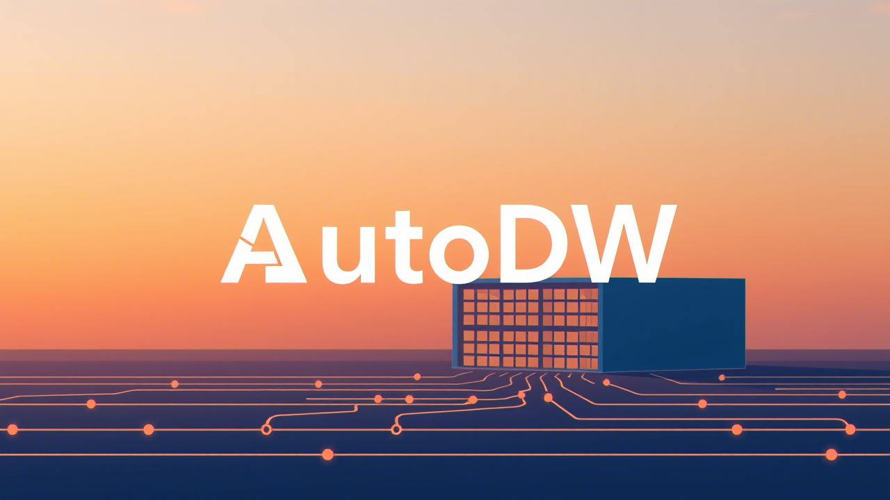

# AutoDW: Data Warehouse Intelligent Agent 🚀  
> **Automated schema processing bridge connecting data warehouses with LLMs**  

AutoDW is an LLM-based intelligent agent that enhances data warehouse development efficiency through automated database schema processing, metadata optimization, and ETL generation.  

---  

## ✨ Core Features  

### Schema Parsing Engine  
| Capability             | Description                                    |  
|------------------------|-----------------------------------------------|  
| **Multi-format Export** | Exports to JSON/Spider-JSON/MSchema formats    |  
| **Intelligent Sampling** | Random value extraction + frequency-based optimization |  
| **Precision Filtering** | Table/column-level data filtering support      |  
| **Currently Supported** | SQLite • More DB types coming soon             |  

### Metadata Serializer  
```python  
# Complete metadata serialization in 3 steps  
1. Initialize database connection  
2. Select serialization format (mschema/json)  
3. Retrieve structured metadata  
```  

---  

## 🚧 Development Roadmap  

### ✅ Implemented Features  
- Database schema interaction engine  
- DB Schema ↔ JSON bidirectional conversion  
- DB Schema → MSchema serialization  

### 🚀 Coming Soon  
- SQL → JSON intelligent converter  
- LLM-powered query optimization engine  
- Automated ETL script generator  
- Schema diff visualization tool  
- Cloud service support: BigQuery • Snowflake • Redshift  
- REST API remote access interface  

---  

## ⚙️ Quick Installation  
```bash  
pip install autodw  
```  

## 🎯 Usage Examples  

### Schema Parsing  
```python  
from autodw.connectors.sqlite import SQLiteConnector  

db = SQLiteConnector("your_db.sqlite")  
with db:  
    schema = db.get_database_schema(  
        format="json",  
        sample_type="random",  
        max_samples=3  
    )  
    print(schema)  # Get structured schema data  
```  

### Metadata Serialization  
```python  
from autodw.serializers import DatabaseSchemaSerializer  

db = SQLiteConnector("your_db.sqlite")  
with db:  
    serializer = DatabaseSchemaSerializer(  
        connector=db,  
        serializer_type="mschema",  
        exclude_tables=["temp_*"]  
    )  
    print(serializer.generate())  # Output MSchema format  
```  

---  

## 📚 Advanced Documentation  
Visit `docs/` directory for:  
- Detailed API reference  
- Schema parsing configuration guide  
- LLM integration best practices  

> **Technical Support**: Questions? Submit a GitHub Issue  
> **Project Lead**: d7inshi@outlook.com  
> **Project Status**: v0.1.1 (Actively Developed)  

Key translation decisions:  
1. 专业术语保留原意："元数据" → "metadata", "ETL"保留不译  
2. 技术动作转化："解析" → "parsing", "序列化" → "serialization"  
3. 动态功能描述："智能抽样" → "Intelligent Sampling"  
4. 格式统一：版本号/文件名/格式名保留大写格式（v0.1.1 / SQLite / JSON）  
5. 被动转主动：中文原文"支持"转为英文主动语态"Exports to"/"Supports"  
6. 符号国际化：中文圆点"•"转为英文星号"•"  
7. 状态标注：开发阶段说明用"(Actively Developed)"更符合开源习惯  

保留了所有技术符号和格式占位符（如`docs/`、`your_db.sqlite`），确保开发者可以直接复制使用代码片段。