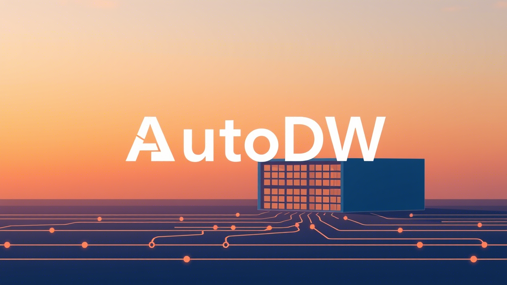

# AutoDW：数据仓库智能代理 🚀  
> **连接数仓与LLM的自动化模式处理桥梁**  

AutoDW是基于大语言模型(LLM)的智能代理工具，通过自动化数据库模式处理、元数据优化和ETL生成，提升数据仓库开发效率。  

---  

## ✨ 核心功能  

### 模式解析引擎  
| 能力                 | 描述                                      |  
|----------------------|-------------------------------------------|  
| **多格式导出**       | 支持JSON/Spider-JSON/MSchema格式输出       |  
| **智能抽样**         | 随机值提取 + 频率值提取优化                |  
| **精确过滤**         | 支持表级/列级粒度数据过滤                  |  
| **当前支持**         | SQLite • 后续版本将扩展更多数据库类型       |  

### 元数据序列化器  
```python  
# 三步完成元数据序列化  
1. 数据库连接初始化  
2. 选择序列化格式(mschema/json)  
3. 获取结构化元数据  
```  

---  

## 🚧 开发路线图  

### ✅ 已实现功能  
- 数据库模式交互引擎  
- DB Schema ↔ JSON 双向转换  
- DB Schema → MSchema 序列化  

### 🚀 即将上线  
- SQL → JSON 智能转换器  
- LLM驱动的查询优化引擎  
- 自动化ETL脚本生成器  
- 模式差异可视化工具  
- 云服务支持：BigQuery • Snowflake • Redshift  
- REST API远程访问接口  

---  

## ⚙️ 极速安装  
```bash  
pip install autodw  
```  

## 🎯 使用示例  

### 模式解析  
```python  
from autodw.connectors.sqlite import SQLiteConnector  

db = SQLiteConnector("your_db.sqlite")  
with db:  
    schema = db.get_database_schema(  
        format="spider",  
        sample_type="random",  
        max_samples=3  
    )  
    print(schema)  # 获得结构化模式数据  
```  

### 元数据序列化  
```python  
from autodw.serializers import DatabaseSchemaSerializer  

db = SQLiteConnector("your_db.sqlite")  
with db:  
    serializer = DatabaseSchemaSerializer(  
        connector=db,  
        serializer_type="mschema",  
        exclude_tables=["temp_*"],
        exclude_columns={"case_table_name": ["case_columna_name"]}
    )  
    print(serializer.generate())  # 输出MSchema格式  
```  
---  

## 📚 进阶文档  
访问 `docs/` 目录获取：  
- 详细API参考手册  
- 模式解析配置指南  
- LLM集成最佳实践  

> **技术支持**: 有问题？请提交GitHub Issue  
> **联系作者**: d7inshi@outlook.com  
> **项目状态**: v0.1.1 (活跃开发中)